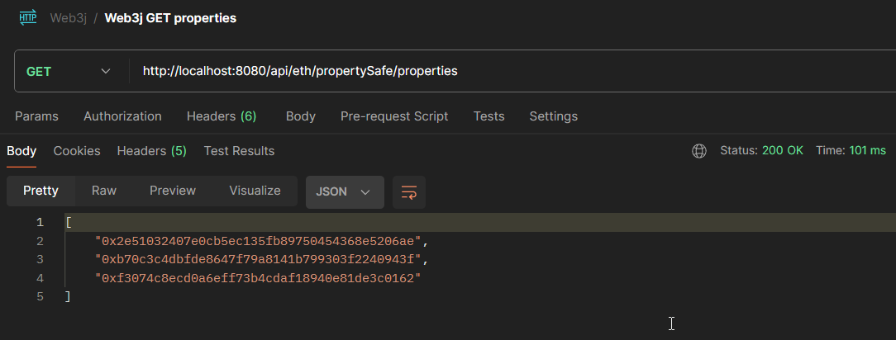
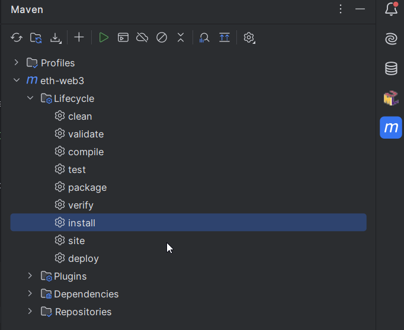
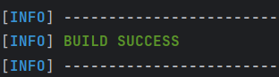

On the [bottom of the README](#web3j-challenges) there are some challenges to get into the topic. Have fun!

# General Web3J information
The application takes advantage of the [Web3J library](https://github.com/web3j/web3j) to communicate with the ethereum blockchain.
To be correct, you connect to an ethereum (main or test net) node via [JSON-RPC](https://www.jsonrpc.org/) connection and retrieve the information this specific node/chain provides.
``` XML
    <dependency>
	<groupId>org.web3j</groupId>
	<artifactId>core</artifactId>
	<version>4.10.3</version>
    </dependency>
```

To also work with Solidity SmartContracts and interact with them within your code, you will have to add two build plugins.
The `web3j-maven-plugin is needed` to generate the Java wrapper classes for your Solidity contracts. 
The `build-helper-maven-plugin` is needed to include the generated classes into your /target/ folder.
More details in the pom.xml

``` XML
    <build>
        <plugins>
            <plugin>
                <groupId>org.web3j</groupId>
                <artifactId>web3j-maven-plugin</artifactId>
                <version>${web3j-maven-plugin.version}</version>
                <executions>
                    <execution>
                        ...
                    </execution>
                </executions>
            </plugin>
            
            <plugin>
                <groupId>org.codehaus.mojo</groupId>
                <artifactId>build-helper-maven-plugin</artifactId>
                <executions>
                    <execution>
                        ...
                    </execution>
                </executions>
            </plugin>
        </plugins>
    </build>
```

# Usage
## keyfile
the given keyfile.json (/src/main/resources/) is a newly generated wallet with some SEPOLIA or Holesky testnet eth.
If you test with this application, you can test with this wallet or create / include your own.

## api development / testing software
tools like Postman or Insomnia are great for testing REST endpoints.
Pros use cURL ;)

### Postman
example for postman or other testing tools:



### cURL
example for the blockNumber endpoint:
``` bash
curl --location 'http://localhost:8080/api/eth/blockNumber'
```

## different ETH node
It is also possible to use every other node by simply replace the _eth.node.address_ variable in application.properties.

You can also override the node by defining it via environment variables (`ETH_NODE_ADDRESS=http....`)


As this is just a showcase / fun project / poc / whatever, there are no special profiles for main or test net.


# Web3j challenges
Hey, glad you're ready to learn about Web3j.</br>
Feel free to fork (or just clone) and play around.

## Challenge 1
* Git clone project (https://github.com/Julius278/eth-web3j)
``` bash
git clone https://github.com/Julius278/eth-web3j.git
```
* (if you have a GitHub account and are familiar with the platform, you can also fork and clone your own repository)
* you're on the "main" branch now
* Build the Java project on the project root directory
``` bash
mvn clean install
```
* alternatively you can use the maven plugin of your IDE, here is an example for Intellij </br>


* it should show a <i>BUILD SUCCESS</i> message </br>


* To play around with the existing functionality you can start the spring boot service
``` bash
mvn spring-boot:run
```
or use the [PlayAroundDemo](https://github.com/Julius278/eth-web3j/blob/main/src/main/java/com/julius/spring/boot/ethweb3/demo/PlayAroundDemo.java)
* Everything is prepared
  * you can just start by choosing your PropertyName and ID (uniqueness is checked on the PropertySafe)
  * you don't have to worry about setting up a node, wallet, funding of your account, transaction fees or the connection

## Challenge 2
* Adjust a given solidity contract (Property.sol, e.g. a new getter function)
``` Solidity
function getTest() external view returns (string memory){....}
```
* Build the Java maven project again 
``` bash
mvn clean install
```
* Use the new getter function in your Java code
* A possible solution is shown in branch: challenge-2-solution, in short you can see it [here](https://github.com/Julius278/eth-web3j/pull/1)

## Challenge 3
Let's do a calculation on-chain
* Add a new solidity function which takes two numbers (int) and returns
* Build the Java maven project again
* Use the new getter function in your Java code
* A possible solution is shown in branch: ?????


## Challenge 99
Write some units tests for your new code ;)